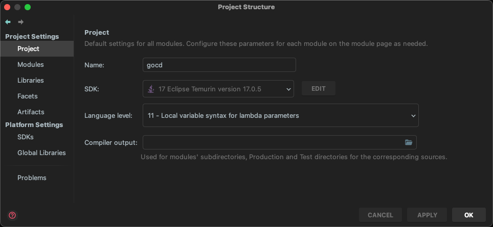
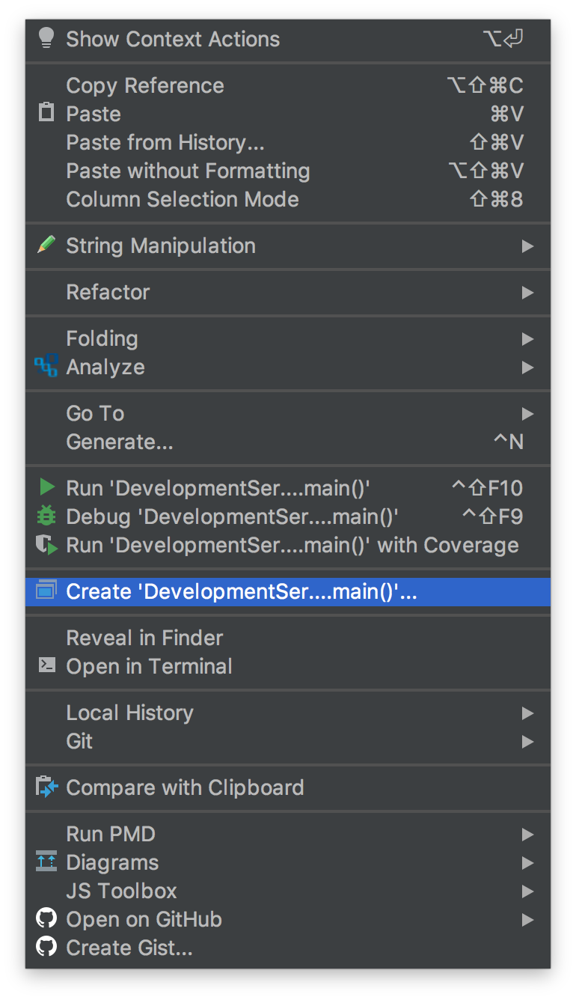
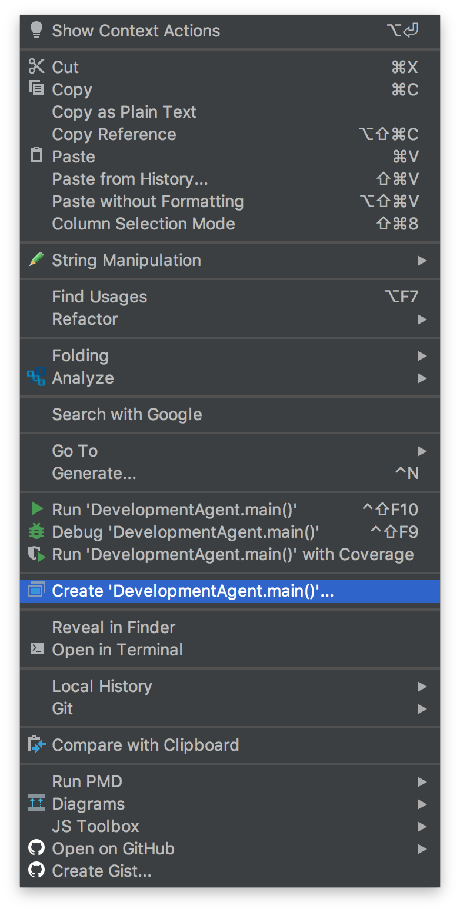
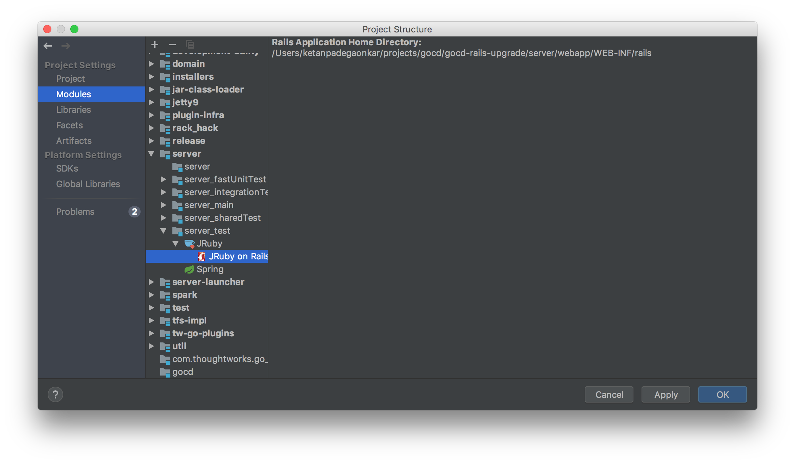
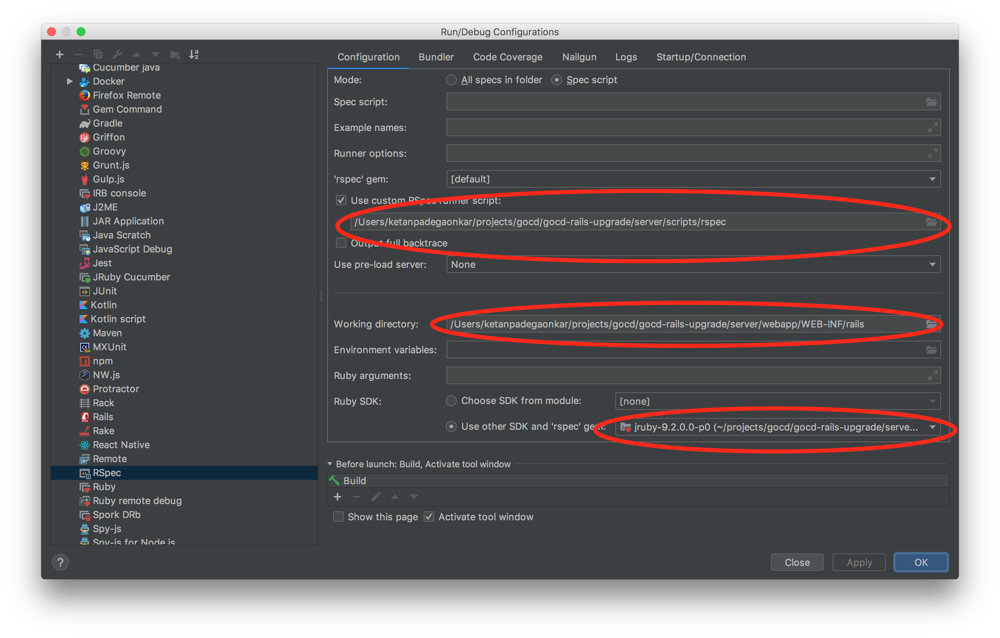

## GoCD Developer Documentation

This documentation should allow you to setup your developement environment to work on the [codebase](https://github.com/gocd/gocd) for [GoCD](https://www.gocd.org), a free and open-source Continuous Delivery server.

---

# Setting up your development environment

## Part 1: Get the code and run a local build

### Use docker image

[tomzo](https://github.com/tomzo) maintains a [docker image](https://github.com/kudulab/docker-gocd-dojo) which can be used to build and test GoCD without installing all tools on the local host. If you have a local docker daemon, consider using the image.
The image uses the same tools which run on https://build.gocd.org GoCD agents, therefore it is consistent with the upstream requirement.

### Manual setup

GoCD requires the following software packages to build

- JDK 12 or above (We recommend downloading it from openjdk, or adoptopenjdk.net)
- Git (1.9+)
- NodeJS latest of 8.x (https://nodejs.org/en/download/)
- Python 2.x [Note: Python 3 does NOT work]
- yarn package manager (https://yarnpkg.com/en/docs/install)
- gcc/g++ 6.x (linux only). CentOS/RH users can find it [here](https://www.softwarecollections.org/en/scls/rhscl/devtoolset-6/). Ubuntu 12.04 and 14.04 users can find it [here](https://launchpad.net/~ubuntu-toolchain-r/+archive/ubuntu/test).
- Microsoft Visual C++ Build Tools 2015 (Windows only). Get it [here](https://chocolatey.org/packages/vcbuildtools)
- Microsoft Build Tools 2015 (Windows only). Get it [here](https://chocolatey.org/packages/microsoft-build-tools)

Assuming the codebase is cloned into `~/projects/go`, you need to execute the
following commands to build GoCD

```bash
~/projects/go$ unset GEM_HOME GEM_PATH # if you're using rvm
~/projects/go$ ./gradlew clean agentGenericZip serverGenericZip
```

After a successful build, the build artifacts are generated inside `target/` sub-directories within individual module directories and the ZIP installers for GoCD Server and GoCD Agent are generated inside `installers/target/distributions/zip/`.

```bash
~/projects/go$ find . -name target -type d
./addon-api/database/target
./agent/target
...
./tfs-impl/target
./util/target
~/projects/go$ ls installers/target/distributions/zip/
go-agent-16.7.0-3795.zip  go-server-16.7.0-3795.zip
```

#### For Windows Users

The easiest way to get started is by using [Chocolatey](https://chocolatey.org)

From an elevated command prompt run the following commands:
```
choco install nodejs --version 8.X.x
choco install python2
choco install yarn
choco install vcbuildtools
choco install microsoft-build-tools
```
You'll then want to set the Python environment variable:
`SETX PYTHON \path\to\python\python.exe` [Note: by default the path is c:\python27\python.exe]

Also ensure that your JAVA_HOME environment variable is pointing to the 64-bit version (i.e. it is in "Program Files" and not "Program Files (x86)")

## Step 2: Setup IntelliJ

1. Prior to creating a GoCD project in IntelliJ, we would have to prepare the working directory. You can achieve this by running the  following command in the working directory. This may take a few minutes to run, so maybe go grab a coffee :)

    ```bash
    ~/projects/go$ ./gradlew clean prepare
    ```

2. After the preparation phase has succeeded, open the project in IDEA

- At this point, IntelliJ is probably prompting you if you want to import the project using gradle. Click *Import Gradle Project*.

  

- Open project settings.

   - Select the latest JDK that is installed

   

   - Setup a JRuby SDK (use `$GOCD_HOME/server/scripts/jruby`) as the Jruby binary

   

- Open Gradle Settings

  - Use the same JDK that you are using with the project.

  

- Install lombok IntelliJ plugin

  - See this link https://projectlombok.org/setup/intellij
  - Restart intellij after installing lombok

- Configure annotation processor

  - The lombok plugin will prompt you to setup an annotation processor

  

- Intellij will also prompt you about "unmapped spring configugration". Click *Create default context* for each of the modules.

  

- (**Workaround for bug in IntelliJ**): Open the file `server/build.gradle` and comment out [these lines](https://github.com/gocd/gocd/blob/ea83f5143211354f37e667fbf11a029386d436b9/server/build.gradle#L361-L363). Wait a few seconds to let IntelliJ/Gradle to import these changes. The uncomment the lines back.

### 2.1: Running Development Server via IntelliJ IDEA

- Open the class `DevelopmentServer`
- Right click and select *Create 'DevelopmentServer.main()'*

  

- Configure the DevelopmentServer JVM args (`-Xmx2g`) and working dir (`$GOCD_HOME/server`)

  

### 2.2: Running Development Agent via IntelliJ IDEA

- Open the class `DevelopmentAgent`
- Right click and select *Create 'DevelopmentAgent.main()'*

  

- Configure the DevelopmentAgent working dir `$GOCD_HOME/agent`

  

### 2.3: Running RSpec tests from the command line

Here are some rspec specific commands you may find useful —

```bash
$ ./gradlew rspec # run all specs, with default arguments
$ ./gradlew rspec -Popts='--pattern spec/**/api_v**/*_spec.rb' # to run api specs
$ ./gradlew rspec -Popts='--pattern spec/controllers' # to run controller specs
$ ./gradlew rspec -Popts='--pattern spec/foo/bar_spec.rb' # to run a single spec
```

It's probably quicker to run the RSpec tests from the command line instead of gradle:

```bash
cd server/webapp/WEB-INF/rails
../../../scripts/jruby -S rspec
../../../scripts/jruby -S rspec --pattern 'spec/**/api_v**/*_spec.rb' # to run api specs
../../../scripts/jruby -S rspec --pattern spec/controllers # to run controller specs
../../../scripts/jruby -S rspec --pattern spec/foo/bar_spec.rb # to run a single spec

```

### 2.4: Running RSpec tests from IntelliJ

1. Ensure that your project module "server>server_test" is setup properly.

  1. Click "File menu > Project Structure"
  2. Select "Modules" in the "Project Structure" dialog
  3. Navigate to "server>server_test" and right-click to add "JRuby" (select the right jruby version). Then right click to add "JRuby on Rails"

    

    

2. Configure the default RSpec run configuration

  1. Open `Run -> Edit configurations...`
  2. Open the `Defaults` section and select `RSpec` in the listing
  3. Check the `Use custom RSpec runner script` checkbox
  4. Select `rspec` from `<project-directory>/server/scripts/jruby/rspec`
  5. Set the working directory to `<project-directory>/server/webapp/WEB-INF/rails`
  6. Set the `Ruby SDK` option to `Use other SDK and 'rspec' gem` with the dropdown set to the correct version of JRuby that you configured above `jruby-9.2.0.0`
     
  7. Click `Apply` to save
  8. Open a spec file and run it `Run -> Run 'somefile_spec.rb'`, or `Ctrl+Shift+F10`

### 2.5: Working on single page apps

If you're working on some of the new pages in GoCD (pipeline config, agents, elastic profiles...), this will watch your filesystem for any JS changes you make and keep compiling the JS in the background. This usually takes a couple of seconds to compile, after you hit save.

```shell
~/projects/go$ cd server/src/main/webapp/WEB-INF/rails
~/projects/go/server/src/main/webapp/WEB-INF/rails$ yarn run webpack-watch
```

### 2.6: Running Javascript tests

To run javascript tests —

In CI environment (very slow for running tests after every change)

```shell
$ ./gradlew jasmine
```

In development environment (very quick)

Visit the following URLs:
* http://localhost:8153/go/assets/webpack/_specRunner.html (The agents, elastic profiles pages. Uses mithril 1.0). Ensure that you are running the [webpack watcher](#2-1-8-working-on-single-page-apps).

In order to run old javascript specs through browser, run following command to start server -

```gradle
./gradlew jasmineOldServer
```

Open a browser and navigate to `http://localhost:8888/`
